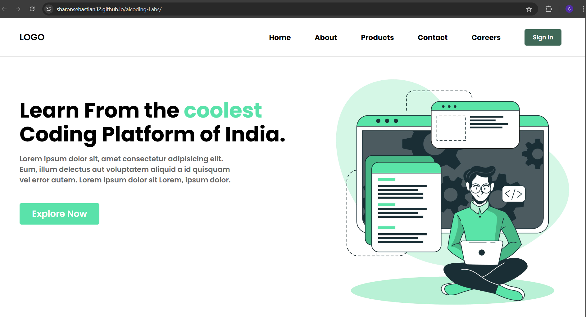

Sure! Here's the updated README with the addition of PC and mobile view screenshots for the site:

---

# AiCoding Labs - Responsive Web Design

This project is a **responsive web design** created to adapt seamlessly for both **PC** and **mobile devices**. The layout is built using **HTML**, **CSS**, and **Media Queries** to ensure the website looks great on any screen size.

## Features

- **Responsive Design**: The webpage automatically adjusts based on the device's screen size, including mobile and desktop views.
- **Media Queries**: Custom styles are applied for different screen sizes, ensuring a good experience across devices (PC, tablets, and mobile phones).
- **Smooth Animations**: The `AOS` library is used for smooth animations and scroll effects, adding interactivity to elements.
- **User-Friendly Navigation**: The navigation bar is simple and easy to use, with a mobile-friendly menu that appears when the screen size is small.

## Technologies Used

- **HTML5**: Used for the structure and content of the webpage.
- **CSS3**: Styles and layout management, including the use of **Flexbox** and **CSS Grid** for responsive design.
- **Media Queries**: To adjust layout and font sizes for different screen sizes.
- **AOS (Animate On Scroll)**: For adding smooth animations to elements as the user scrolls through the page.

## Project Structure

```
AiCoding Labs
│
├── index.html          # Main HTML file
├── style.css           # Stylesheet with layout and design
└── assets/
    └── images/         # Folder for images (e.g., 'coding.png')
```

## How to Use

1. **Clone the repository** or download the source code.
2. Open the `index.html` file in your browser to view the website.
3. Customize the content and styles according to your preferences.

### Example:

```html
<div class="nav">
  <h2>LOGO</h2>
  <div class="nav-part-2">
    <h4>Home</h4>
    <h4>About</h4>
    <h4>Products</h4>
    <h4>Contact</h4>
    <h4>Careers</h4>
    <i class="ri-menu-3-fill"></i>
    <button class="nav-btn">Sign In</button>
  </div>
</div>
```

### Media Query Example:

```css
@media (max-width: 768px) {
  .nav {
    padding: 0 5vw;
    height: 60px;
  }
  .nav h2 {
    font-size: 5.1vw;
  }
  .nav h4 {
    font-size: 4vw;
    display: none;
  }
  .nav i {
    display: block;
    font-size: 4.5vw;
  }
  .nav button {
    display: none;
  }
  .content {
    height: calc(100% - 60px);
    flex-direction: column;
  }
  .left {
    width: 100%;
    height: 50%;
    padding: 4vw 5vw;
  }
  .right {
    width: 100%;
    height: 50%;
  }
}
```

## Screenshot

### Desktop View (PC):

Here’s how the webpage looks on a desktop or larger screen. The content is arranged side-by-side, with a horizontal navigation menu.



### Mobile View (Phone/Tablets):

Here’s how the webpage looks on a mobile or tablet device. The layout stacks vertically, and the navigation menu collapses into an icon.


## Acknowledgements

- **Google Fonts**: Used Poppins font for typography styling.
- **Remix Icon**: Used for icons (e.g., menu icon).
- **AOS Library**: Used for scroll animations.

## License

This project is open source and available under the MIT License.

---
# AiCodingLabs
